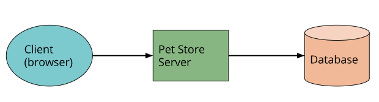
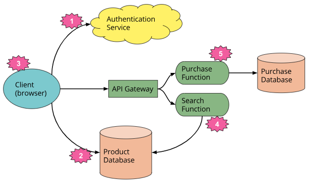
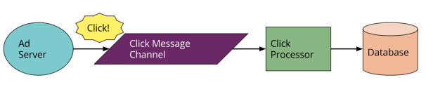
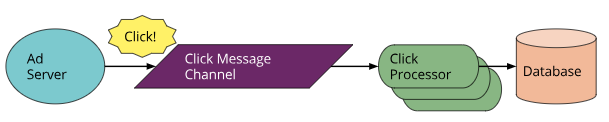
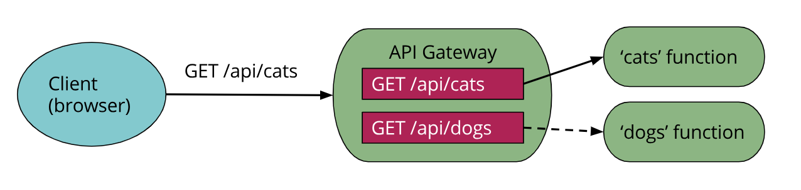
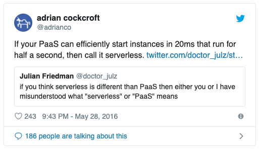
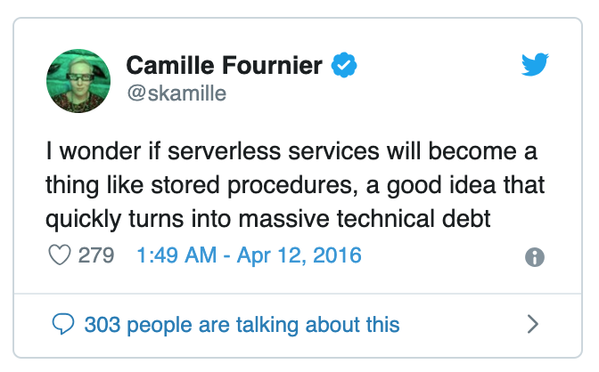
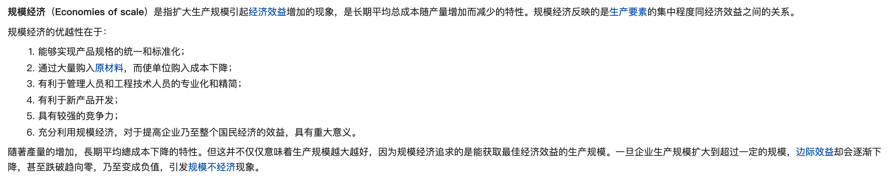

>本文整理自Mike Roberts的文章，原文链接：https://martinfowler.com/articles/serverless.html，本文首先用较长的篇幅举例说明了什么是Serverless，从不同角度阐述了Serverless的利弊；并且与现有的系统架构做了对比，引入其他业界权威人士关于Serverlss的讨论，到目前为止这是我看到的对Serverless表述最全面的文章。

# Serverless架构

>*Serverless架构是将第三方“Backend as a Service”（BaaS）服务和/或包括在“Function as a Service”（FaaS）平台上托管的、短暂的容器中运行的自定义代码的应用程序设计。通过使用这些以及相关的思想（如单页应用程序），这种体系结构消除了对传统的始终在线服务器组件的大量需求。Serverless架构可能受益于显著降低的运营成本、复杂性和工程交付周期，同时增加了对供应商依赖性和相对不成熟的支持服务的依赖。*

## 什么是Serverless架构
可以将Serverless理解为两个不同却又有重叠的两个部分：
1. 首先，Serverless用于描述大量或完全结合第三方、云托管应用程序和服务的应用程序，以管理服务器端逻辑和状态。这些通常是“富客户端”应用程序，例如单页Web应用程序，或使用云可访问数据库（如Parse、FireBase）、身份验证服务（如Auth0、AWS Cognito）等庞大生态系统的移动应用程序。这些类型的服务以前被描述为“[(Mobile) Backend as a Service](https://en.wikipedia.org/wiki/Mobile_backend_as_a_service)”。
2.  Serverless也可以表示服务器端逻辑仍由应用程序开发人员编写的应用程序，但与传统体系结构不同，它运行在无状态计算容器中，这些容器是事件触发的、短暂的（可能只持续一次调用），并且完全由第三方管理。考虑到这一点的一种方法是“Function as a Service”或“FaaS”。

## 例子
### UI驱动的应用（UI-driven applications）

让我们考虑一个具有服务器端逻辑的传统的面向客户端的三层架构系统。一个很好的例子是一个典型的电子商务应用程序，比如说一个在线宠物商店：
传统上，架构如下图所示。假设它是用服务器端是用Java或JavaScript实现的，HTML+JavaScript组件作为客户端：

这样架构相对来说不是特别智能，因为在服务器应用中实现了太多的系统逻辑，比如认证授权，页面导航，搜索，事务。

对于Serverless架构，最终可能会看起来更像这样：

这是一个大大简化的视图，但即使在这里，我们也看到了一些重要的变化：

1. 我们删除了原始应用程序中的身份验证逻辑，并将其替换为第三方BaaS服务（例如，auth0）。
2. 使用BaaS的另一个例子，我们允许客户直接访问我们的数据库的一个子集（用于产品列表），它本身完全由第三方（如Google FireBase）托管。与访问数据库的服务器资源相比，我们可能有不同的客户访问数据库的安全配置文件。
3. 前两点暗示了一个非常重要的第三点：宠物店服务器中的一些逻实现在客户端中——例如，跟踪用户会话、了解应用程序的UX结构、从数据库中读取数据并将其转换为可用视图等。客户机正在很好地成为单页应用程序（[Single Page Application](https://en.wikipedia.org/wiki/Single-page_application)）。
4. 我们可能希望在服务器中保留一些与UX相关的功能，例如，如果它是计算密集型的，或者需要访问大量数据。在我们的宠物店中，一个例子是“搜索”。我们可以实现FaaS功能，通过API网关响应HTTP请求（稍后描述），而不是像原始体系结构中那样始终运行的服务器。客户机和服务器的“搜索”功能都从同一数据库中读取产品数据。
5. 最后，我们可以用另一个单独的FaaS Function替换我们的“购买”功能，出于安全原因选择将其保留在服务器端，而不是在客户端中重新实现。它前面也有一个API网关。在使用FaaS时，将不同的逻辑需求分解为单独部署的组件是一种非常常见的方法。

退一步说，这个例子演示了关于Serverless架构的另一个非常重要的点。在原始版本中，所有流、控制和安全都由中央服务器应用程序管理。在Serverless版本中，这些问题没有中央仲裁器。相反，我们看到了一个偏好----**choreography over orchestration**，每个组件都扮演着一个更具体系结构意识的角色，这也是微服务方法中常见的一个想法。

这种方法有很多好处。正如Sam Newman在他的《构建微服务》一书中指出的那样，以这种方式构建的系统通常“更灵活，更易于更改”，无论是作为一个整体，还是通过对组件的独立更新；对问题进行了更好的拆分；还有成本上的好处，这一点Gojko Adzic在[这篇精彩的演讲](https://gojko.net/2017/10/05/serverless-design-gotocph.html)中讨论过。

当然，这样的设计是一种权衡：它需要更好的分布式监控，而且我们更依赖于底层平台的安全功能。从根本上讲，我们需要处理的移动部件比我们最初使用的单片应用程序要多得多。灵活性和成本的好处是否值得增加多个后端组件的复杂性，这取决于上下文。

### 消息驱动的应用（Message-driven applications）

另一个例子是后端数据处理服务。

假设您正在编写一个以用户为中心的应用程序，它需要快速响应UI请求，其次，它需要捕获正在发生的所有不同类型的用户活动，以便进行后续处理。想想一个在线广告系统：当用户点击一个广告时，你想很快地将他们重定向到该广告的目标。同时，你需要收集点击已经发生的事实，这样你就可以向广告商收费。

传统上，架构可能如下所示。“Ad Server”同步响应用户（图中未显示），并向Channel发送“点击消息”。然后，“Click Processor”应用程序将异步处理此消息，更新数据库，例如减少广告客户的预算。

在Serverless的世界中，这看起来如下：

你能看到区别吗？与第一个例子（Pet store）相比，这里的架构变化要小得多，这就是为什么异步消息处理是Serverless技术非常流行的用例。我们已经用FaaS Function替换了一个长期使用的消息消费者应用程序。此函数在供应商提供的事件驱动上下文中运行。请注意，云平台供应商同时提供消息代理和FaaS环境，这两个系统彼此紧密相连。

FaaS环境还可以通过实例化函数代码的多个副本并行处理多个消息。这取决于我们如何编写原始过程（original process），这可能是我们需要考虑的一个新概念。

## 深入Function as a Service（Unpacking "Function as a Service"）

我们已经提到了很多关于FaaS的东西，是时候深入去看它到底意味着什么。为此，我们首先来看一下亚马逊FaaS产品Lambda的描述。作者在上面加了一些注释：

> *AWS Lambda lets you run code without provisioning or managing servers.* **(1)** *... With Lambda, you can run code for virtually any type of application or backend service* **(2)** *- all with zero administration. Just upload your code and Lambda takes care of everything required to run* **(3)** *and scale* **(4)** *your code with high availability. You can set up your code to automatically trigger from other AWS services* **(5)** *or call it directly from any web or mobile app* **(6)***. *

1. 从根本上讲，FaaS是在不管理你的服务器系统或你的"长期运行的服务器应用程序“的情况下运行后端代码。当与容器和PaaS（平台即服务）等现代体系结构趋势进行比较时，第二条“长期运行的服务器应用程序”是一个关键区别。

   如果我们回到前面的Click-processing的例子（就是广告那个例子），FaaS通过某种不需要服务器或者不需要应用程序一直运行的方式替换了点击处理服务器（可能是物理机器，但肯定是特定的应用程序）。

2. FaaS产品不需要编码到特定的框架或库中。FaaS函数在语言和环境方面是常规应用程序。例如，AWS lambda函数可以在Javascript、Python、Go、任何JVM语言（Java、Culjule、Scala等）或任何.NET语言中实现“first class”。然而，lambda函数也可以执行与另一个部署项目捆绑在一起的进程，因此您实际上可以使用任何可以编译为Unix进程的语言（参见本文后面的apex）。

   尽管如此，FaaS功能具有显著的体系结构限制，尤其是在状态和执行持续时间方面。

   让我们再次考虑一下我们的点击处理示例。当迁移到FaaS时，唯一需要更改的代码是“主方法”（启动）代码，因为它被删除，并且可能是顶级消息处理程序（消息侦听器接口）实现的特定代码，但这可能只是方法签名的更改。其余的代码（例如，写入数据库的代码）在FaaS世界中没有什么不同。

3. 部署与传统系统非常不同，因为我们没有自己运行的服务器。在FaaS环境中，我们将函数的代码上传到FaaS服务提供者，从而执行配置资源、实例化虚拟机、管理进程等所需的所有其他操作。

3. 水平伸缩是完全自动的、弹性的，并由提供者管理。如果您的系统需要并行处理100个请求，那么提供者将处理这些请求，而不需要您进行任何额外的配置。执行函数的“计算容器”是短暂的，FaaS提供者创建和销毁它们纯粹是由运行时需求驱动的。最重要的是，有了FaaS，供应商可以处理所有底层的资源配置和分配，用户根本不需要集群或虚拟机管理。

   让我们回到Click-processor。假设我们今天过得很愉快，客户点击的广告数量是平常的十倍。对于传统的体系结构，我们的点击处理应用程序能够处理这个问题吗？例如，我们是否开发了能够一次处理多条消息的应用程序？如果我们这样做了，一个正在运行的应用程序实例是否足以处理负载？如果我们能够运行多个进程，缩放是自动的还是需要手动重新配置？使用FaaS的方式，所有这些问题都已经得到了解答，您需要提前编写函数来假设水平伸缩的并行性，但是从那时起FaaS提供程序会自动处理所有缩放需求。

4. FaaS中的函数通常由提供程序定义的事件类型触发。对于Amazon AWS，此类刺激包括S3（文件/对象）更新、时间（计划任务）和添加到消息总线的消息（例如，Kinesis）。

5. 大多数提供者还允许函数作为对入站HTTP请求的响应而触发；在AWS中，通常通过使用API网关来实现这一点。我们在宠物店中使用了API网关作为“搜索”和“购买”功能的示例。函数也可以通过平台提供的API直接调用，可以从外部调用，也可以从同一个云环境中调用，但这是一种比较少见的用法。

### 状态（State）

当FaaS函数涉及到本地（机器/实例绑定）状态时，它有很大的限制，即存储在内存变量中的数据，或写入本地磁盘的数据。您确实有这样的存储可用，但是您不能保证这种状态在多个调用中是持久存在的，而且更强烈地说，您不应该假定一个函数的一次调用的状态对同一个函数的另一次调用是可用的。因此，FaaS函数通常被描述为无状态的，但更准确地说，FaaS函数的任何状态（需要持久化）都需要在FaaS函数实例之外进行外部化。

FaaS Function天生就是无状态的。比如，那些为输入到输出提供纯函数转换的函数，这是不需要考虑状态的。但对于其他人来说，这（无状态）可能会对应用程序体系结构产生很大的影响，尽管这不是一个独特的限制条件，[“Twelve-Factor app”](<https://12factor.net/>)概念有着[完全相同的限制](<https://12factor.net/processes>)。这种面向状态的函数通常使用数据库、跨应用程序缓存（如Redis）或网络文件/对象存储（如S3）来存储跨请求的状态，或提供处理请求所需的进一步输入。

### 执行时间（Execution duration）

FaaS函数通常允许限制每次调用的时间。目前，对一个AWS lambda函数响应事件的“超时”最多是在被终止之前的五分钟。Microsoft Azure和Google云功能也有类似的限制。

这意味着，如果没有重新架构（re-architecture），某些长时间运行的任务类不适合FaaS函数，您可能需要创建几个不同的相互协作的FaaS函数，而在传统环境中，您可能有一个长时间运行任务正在执行和相互协作。

### 启动延迟和"冷启动"(Startup latency and “cold starts”)

FaaS平台在每个事件之前初始化函数的实例需要一些时间。即使对于一个特定的函数，启动延迟也会有很大的变化，这取决于大量的因素，并且可能在几毫秒到几秒之间。这听起来很糟糕，但让我们更具体一点，以AWS lambda为例。

lambda函数的初始化要么是“热启动”——从以前的事件中重用lambda函数及其主机容器的实例，要么是“冷启动”——创建一个新的容器实例，启动函数主机进程等。毫无疑问，在考虑启动延迟时，冷启动最值得关注。

冷启动延迟取决于许多变量：您使用的语言，您使用的库数量，您拥有的代码数量，Lambda函数环境本身的配置，是否需要连接到VPC资源等等。这些方面受开发人员的控制，因此通常可以减少作为冷启动的一部分而产生的启动延迟。

和冷启动时间同样的因素是冷启动的频率。例如，如果一个函数每秒处理10个事件，每个事件需要50毫秒来处理，那么每隔100,000-200,000个事件，您可能只会看到Lambda的冷启动。另一方面，如果您每小时处理一次事件，您可能会看到每个事件的冷启动，因为Amazon会在几分钟后退出非活动的Lambda实例。了解这一点有助于您了解冷启动是否会对聚合产生影响，以及您是否希望对您的函数实例执行“保持活跃”，以避免它们被放在pasture上。

冷启动需要被关注吗？这取决于您的应用程序的风格和流量类型。作者在Intent Media的前团队有一个用Java实现的异步消息处理Lambda应用程序（通常是启动时间最慢的语言），每天处理数亿条消息，他们不关心这个组件的启动延迟。也就是说，如果您正在编写一个低延迟交易应用程序，那么您可能不希望此时使用云托管的FaaS系统，无论您使用何种语言进行实施都没有关系。

无论您是否认为您的应用程序可能存在这样的问题，您都应该使用类似产品的负载测试性能。

有关冷启动的更多详细信息，请[参阅](<https://blog.symphonia.io/learning-lambda-part-8-addfab6b460d>)。

### API Gateway

前面提到的Serverless的一个方面是“API网关”。API网关是一个HTTP服务器，其中路由（Routes）和端点（endpoints）是在配置中定义的，并且每个路由都与处理该路由的资源相关联。在Serverless架构中，此类处理程序通常是FaaS函数。

当API网关收到请求时，它会找到与请求匹配的路由配置，如果有一个路由和一个FaaS函数匹配，原始请求将会调用相关的FaaS函数。通常，API网关将允许从HTTP请求参数映射到FaaS函数更简洁的输入，通常为JSON对象，或者允许整个HTTP请求通过。FaaS函数将执行其逻辑并将结果返回到api网关，然后将此结果转换为HTTP响应，并将其传递回原始调用方。

AWS有自己的API网关（有点让人困惑的名字叫“API网关”），其他供应商也提供类似的功能。亚马逊的API网关是一个BaaS（是的，BaaS！）服务本身就是一个服务，因为它是一个您配置的外部服务，但不需要自己运行或提供。

除了纯粹的路由请求之外，API网关还可以执行身份验证、输入验证、响应代码映射等。

有FaaS函数的api网关的一个用例是以Serverless方式创建HTTP前端的微服务，它具有FaaS功能带来的所有扩展、管理和其他好处。

## What isn't Serverless?

到目前为止，在本文中，我已经将Serverless描述为两种思想的结合：BaaS和FaaS。我还深入研究了后者的能力。为了更准确地了解我所看到的Serverless服务的关键属性（以及为什么我认为更老的服务（如S3）是Serverless的），参考：[定义Serverless](<https://blog.symphonia.io/defining-serverless-part-1-704d72bc8a32>)。

在我们开始研究非常重要的优点和缺点之前，我想在定义上再花一点时间。让我们定义一下什么不是Serverless。

### 和PaaS对比

考虑到Serverless FaaS 函数与十二要素应用程序非常相似，它们是否只是“Platform as a Service”（paas）的另一种形式，如heroku？简单地说，我引用了Adrian Cockcroft的推特：

换句话说，大多数PaaS应用程序并不是为了响应事件而将整个应用程序启动和关闭，而FaaS平台恰恰是这样做的。

如果我是一个优秀的十二要素应用程序开发人员，这不一定影响我如何编程和设计我的应用程序，但它确实对我如何运维有很大的影响。因为我们都是很好DevOps-savvy工程师，所以我们对运维的思考和对开发的思考一样多，对吧？

FaaS和PaaS之间的关键操作区别在于可伸缩性。一般来说，对于PaaS，您仍然需要考虑如何缩放，例如，对于Heroku，您希望运行多少个Dyno？对于FaaS应用程序，这是完全透明的。即使将您的PaaS应用程序设置为自动缩放，您也不会将此设置为单个请求的级别（除非您有一个非常具体的流量配置文件），因此在成本方面，FaaS应用程序更高效。

考虑到这个好处，你为什么还要使用PaaS？有几个原因，但工具可能是最大的。还有一些人使用像CloudFoundry这样的PaaS平台，在公共云和私有云混合的基础上提供共同的开发体验；在撰写本文时，还没有一个与此相当成熟的FaaS。

### 和容器对比

使用无服务器FaaS的原因之一是避免在操作系统级别管理应用程序进程。PaaS服务，如Heroku，也提供了这种功能，我在上面已经描述了PaaS与Serverless FaaS的区别。另一个流行的进程抽象是容器，Docker是这种技术最明显的例子。容器托管系统（如Meos和Kubernetes）从操作系统级部署中抽象出单个应用程序，越来越受欢迎。更进一步，我们可以看到云托管容器平台（如Amazon ECS和EKS）和谷歌容器引擎（如无服务器FaaS），它们让团队完全不必管理自己的服务器主机。考虑到容器的势头，考虑无服务器FaaS是否仍然值得？

主要地，我对PaaS的观点仍然适用于容器——对于Serverless的FaaS，伸缩是自动管理、透明和细粒度的，这与我前面提到的自动资源配置和分配有关。传统上，容器平台仍然需要您管理集群的大小和形状。

我还认为容器技术还不成熟和稳定，尽管它越来越接近成熟和稳定（作者的文章写于2017年，当时的容器技术还不够成熟）。当然，这并不是说无服务器FaaS已经成熟了，从两者中挑选一个依然是一个需要考虑的事。

同样重要的是，现在可以在容器平台中使用自扩展容器集群。 Kubernetes内置了“Horizontal Pod Autoscaling”，而像AWS Fargate这样的服务也实现了“Serverless Container”的承诺。

当我们看到无服务器FaaS和托管容器之间的管理和扩展差距缩小时，它们之间的选择可能只取决于应用程序的样式和类型。例如，FaaS可能被视为事件驱动样式的更好选择，每个应用程序组件的事件类型很少，容器被视为具有许多入口点（Entry Point）的同步请求驱动（synchronous-request–driven）组件的更好选择。我希望在很短的时间内，许多应用程序和团队都会使用这两种体系结构方法，并且看到这种使用模式的出现将会非常有吸引力。

### No Ops

Serverless并不意味着“No Ops” - 虽然它可能意味着“没有系统管理员”（No sysadmin），这取决于你去的Serverless兔子洞的距离（depending on how far down the Serverless rabbit hole you go）。

“Ops”比"server administration"意味着更多。它还至少意味着：监控，部署，安全性，网络，支持，以及通常一些生产调试和系统扩展。这些问题在Serverless应用程序中仍然存在，您仍然需要一个策略来处理它们。在某些方面，Ops在Serverless世界中更难，因为其中很多都是如此新潮。

Sysadmin依然存在，只是你外包给了Serverless。这并不是一件坏事或者好事——我们有很多外包，它的好处和坏处依赖于具体你尝试要去做的事情。无论哪种方式，在某些时候抽象可能会泄漏，你需要知道某个地方的人类系统管理员正在支持你的应用程序。

[Charity Majors](https://twitter.com/mipsytipsy)在第一个Serverlessconf上就[这个主题进行了很好的讨论](https://www.youtube.com/watch?v=wgT5f0eBhD8)。 （您还可以阅读她的两篇文章：[WTF is operations?](https://charity.wtf/2016/05/31/wtf-is-operations-serverless/)和[Operational Best Practices](https://charity.wtf/2016/05/31/operational-best-practices-serverless/)。）

### 存储过程即服务（Stored Procedures as a Service）

我看到的另一个主题是Serverless FaaS就是“存储过程即服务”（Stored Procedures as a Service）。我认为这是因为很多FaaS函数的例子（包括我在本文中使用的一些）都是一小段代码，并且与数据库紧密集成。如果这就是我们可以使用FaaS的全部，我认为这个名称会很有用，但因为它实际上只是FaaS功能的一个子集，所以我认为用这些术语来思考FaaS是没有用的。

话虽如此，值得考虑FaaS是否存在一些存储过程相同的问题，包括Camille在上述推文中提及的技术债务问题。使用存储过程可以获得许多教训，这些存储过程值得在FaaS环境中进行检查并查看它们是否适用。

考虑一下存储过程：

1. 通常需要特定于供应商的语言，或者至少需要特定于供应商的语言框架/扩展。
2. 很难测试，因为它们需要在数据库的上下文中执行。
3. 对版本控制或作为一等应用程序（first class application）处理是棘手的。

虽然并非所有这些都必然适用于存储过程的所有实现，但它们肯定会遇到问题。让我们看看它们是否适用于FaaS：

- For（1）对于我到目前为止看到的FaaS实现绝对不是一个问题，因此我们可以立即从列表中删除它。

- For（2）因为我们正在处理“只是代码”，所以单元测试绝对和其他任何代码一样简单。集成测试虽然是一个不同的问题，我们将在后面讨论。

- For（3）再次，因为FaaS功能是“只是代码”版本控制是可以的。直到最近，应用程序打包也是一个问题，但是已经逐渐成熟，使用亚马逊的[Serverless Application Model](https://docs.aws.amazon.com/lambda/latest/dg/serverless_app.html)（SAM）和前面提到的Serverless框架等工具。在2018年初，亚马逊甚至推出了“[Serverless Application Repository](https://aws.amazon.com/serverless/serverlessrepo/)”（SAR），为组织提供了一种基于AWS Serverless服务构建应用程序和应用程序组件的方法。 （更多关于SAR参考：“[Examining the AWS Serverless Application Repository](https://blog.symphonia.io/examining-the-aws-serverless-application-repository-9ef316e2fd4)”）

## Benifits

到目前为止，我主要解释了Serverless Architecture的含义。现在，我将讨论这种设计和部署应用程序的方法的一些优点和缺点。如果没有反复思考和权衡利弊，你绝对不应该决定使用Serverless。

让我们从[rainbows and unicorns](https://www.urbandictionary.com/define.php?term=rainbows%20and%20unicorns)的地方开始，看看Serverless的好处。

### 降低运维成本(Reduced operational cost)

> 

Serverless是最简单的外包解决方案。它允许您向某人付费以管理您自己可能管理的服务器，数据库甚至应用程序逻辑。由于您正在使用许多其他人也将使用的预定义服务，因此我们看到了规模经济（[Economy of Scale](https://en.wikipedia.org/wiki/Economies_of_scale)）效应：因为一个供应商运行着数千个非常相似的数据库，所以你为管理数据库的花费就越低。

(可以简单理解为：因为量大，所以便宜)。

降低的成本在两个方面表现为总和。首先是纯粹来自与其他人共享基础设施（例如，硬件，网络）的基础设施成本增益。第二个是人工成本增加：相比自己开发和管理，您可以在外包的Serverless系统上花费更少的时间。

但是，这种好处与您从基础架构即服务（IaaS）或平台即服务（PaaS）中获得的好处并没有太大差别。但我们可以通过两种主要方式扩展这种优势，每种方式都适用于无服务器BaaS和FaaS。

### BaaS：降低了开发成本(BaaS: reduced development cost)

IaaS和PaaS基于服务器和操作系统管理可以商品化的前提。另一方面，Serverless BaaS是整个应用程序组件商品化的结果。

身份验证是一个很好的例子许多应用程序编写自己的身份验证功能，这些功能通常包括注册，登录，密码管理以及与其他身份验证提供程序集成等功能。总的来说，这种逻辑在大多数应用程序中非常相似，并且已经创建了像Auth0这样的服务，以允许我们将现成的身份验证功能集成到我们的应用程序中，而无需我们自己开发它。

同样对于BaaS databases，例如[Firebase's database service](https://firebase.google.com/docs/database/)。一些移动应用程序团队发现让客户端直接与服务器端数据库通信是有意义的。 BaaS数据库消除了大部分数据库管理开销，并且通常提供以Serverless应用程序所期望的模式对不同类型的用户执行适当授权的机制。

根据您的背景，这些想法可能会让您感到不安（可能出于我们将在缺陷部分介绍的原因）。但是不可否认的是，那些成功的公司，他们的引人注目的产品可以没有任何服务端代码。Joe Emison在第一届Serverless Conference上给了[几个例子](http://www.slideshare.net/ServerlessConf/joe-emison-10x-product-development)。

### FaaS: 伸缩成本(FaaS: scaling costs)

正如前文提到的那样，Serverless FaaS最大的好处就是完全自动化的、弹性的和被第三方托管的横向伸缩。

这有几个好处，但在基本的基础架构方面，最大的好处是您只需支付所需的计算，在AWS Lambda的情况下，最低可达100ms。依赖于你的流量规模和类型，这将带来巨大的经济收益。

#### 示例：间隔性的请求(Example: occasional requests)

假设您正在运行的服务器应用程序每分钟只处理一个请求，处理每个请求需要50毫秒，而您在一小时内的平均CPU使用率为0.1％。如果将此应用程序部署到其自己的专用主机，那么这非常低效。其他一千个类似的应用程序都可以共享这台机器。

无服务器FaaS捕获了这种低效率，以降低的成本带来收益。使用上面的示例应用程序，您每分钟只需支付100毫秒的计算费用，这是整个时间的0.15％。

这具有以下连锁效益：

- 对于具有非常小的负载要求的潜在微服务，它支持按逻辑/域分解组件，即使这种精细粒度的操作成本可能已经过高。
- 这样的成本效益是一个伟大的民主化者。如果公司或团队想要尝试一些新的东西，那么当他们使用FaaS满足他们的计算需求时，可以在很低的成本下开始一段新的旅程（dipping their toe in the water）。实际上，如果您的总工作量相对较小（但并非完全无关紧要），由于某些FaaS供应商提供的“免费套餐”（free tier），您可能根本不需要为任何计算付费。

#### 示例：变化的流量

让我们来看另外一个例子。假如你的流量是起伏不定的，并且你的流量的baseline是每秒处理20个请求，但是每间隔5分钟，你每秒会收到20个请求，持续10秒。为了示例，我们还假设您的基准性能（baseline performance）最大化了您的首选主机服务器类型，并且您不希望在流量峰值阶段减少响应时间。你怎么解决这个问题？

在传统环境中，您可能需要将总硬件数量增加10倍，而不只是处理峰值的情况，即使峰值的总持续时间不到总机器正常运行时间的4％。自动扩展可能不是一个好的选择，因为新的实例启动时，服务器需要长时间才能启动，此时峰值阶段将结束。

对于Serverless FaaS来说这并不是一个问题。你的流量配置不会发生任何改变，只需要为波峰阶段的流量额外的计算付费就行。

显然，我故意在这里选择Serverless FaaS可以节省大量成本的示例，但重点是从扩展的角度来看，FaaS可以为你节约成本。除非你有一个一直使用服务器主机的整个容量、非常稳定的流量形状。

关于上述内容的一个警告：如果您的流量是统一的并且能够始终如一地利用正在运行的服务器，您可能看不到这种成本效益，并且您实际上使用FaaS可能花费更多。您应该进行一些数学运算，并将当前的提供商成本开销与运行全时服务器进行比较，以确定成本是否可接受。

有关FaaS成本效益的更多详细信息，我建议使用该文章[Serverless Computing: Economic and Architectural Impact](http://www.doc.ic.ac.uk/~rbc/papers/fse-serverless-17.pdf)。

#### 优化是节约成本的根本(Optimization is the root of some cost savings)

对于FaaS成本还有一个有趣的方面：您对代码进行的任何性能优化不仅会提高应用程序的速度，而且还会直接、立即导致运维成本的降低，这具体取决于您的供应商的收费方案的粒度。 例如，假设应用程序最初需要一秒钟来处理事件。 如果通过代码优化将其减少到200毫秒，它将（在AWS Lambda上）立即看到计算成本节省80％而不进行任何基础架构更改。

### 运维管理变得更加简单(Easier operational management)

下一部分附带一个巨大的星号 - 运维的某些方面对于Serverless来说仍然很难，但是现在我们仍然坚持我们的[rainbows and unicorns](https://www.urbandictionary.com/define.php?term=rainbows%20and%20unicorns)朋友。

在Serverless的BaaS方面，很明显为什么运维管理比其他架构更简单：支持更少的组件等于更少的工作。

在FaaS方面，有许多方面在起作用，我将深入研究其中的几个方面。

#### FaaS的伸缩收益不仅仅是基础设施的成本方面（Scaling benefits of FaaS beyond infrastructure costs）

经过上一节的描述，伸缩(Scaling)在我们脑海中依然是一个新东西。值得注意的是，FaaS的函数级的扩展不仅降低了计算成本，还简化了运维管理，因为伸缩是自动的。

在最好的情况下，如果您的伸缩过程是手动的，那么需要人明确地向一组服务器添加和删除实例 - 使用FaaS，您可以高兴地忘记这一点并让您的FaaS供应商为您伸缩您的应用程序。

即使您已经在非FaaS架构中使用自动伸缩，但这仍然需要设置和维护。 FaaS不再需要这项工作。

类似地，**因为扩展是提供商基于每个请求或事件的** ，因此您不再需要考虑在内存不足或看到太多性能冲击之前可以处理多少并发请求的问题 - 至少系统中的托管的FaaS组件不用考虑这个问题。 考虑到其负载可能显着增加，必须重新考虑下游数据库和非FaaS组件。

#### 降低了打包和部署的复杂度（Reduced packaging and deployment complexity）

与部署整个服务器相比，打包和部署FaaS Function非常简单。您所做的就是将所有代码打包到一个zip文件中，然后上传它。没有Puppet / Chef，没有启动/停止shell脚本，也没有关于是否在计算机上部署一个或多个容器的决定。如果您刚开始使用，甚至不需要打包任何东西 - 您可以在供应商控制台本身编写代码（显然，这不建议用于生产环境的代码！）。

这个过程不需要花费很长时间来描述，但对于一些团队而言，这种好处可能非常巨大：完全的Serverless解决方案需要零系统管理。

PaaS解决方案具有类似的部署优势，但正如我们之前所看到的，在将PaaS与FaaS进行比较时，扩展优势是FaaS独有的。

#### 上市时间和持续实验（Time to market and continuous experimentation）

更容易的运维管理是我们工程师所理解的好处，但这对我们的业务意味着什么？

显而易见的原因是成本：花在操作上的时间减少等于操作所需的人数减少，正如我已经描述的那样。但在我看来，一个更重要的原因是[上市时间](<https://en.wikipedia.org/wiki/Time_to_market>)。随着我们的团队和产品越来越多地面向精益和敏捷流程，我们希望不断尝试新事物并快速更新现有系统。虽然在持续交付的情况下进行简单的重新部署可以快速迭代稳定的项目，但是具有良好的新想法到初始部署（*new-idea-to-initial-deployment*）能力使我们能够以低摩擦和最低成本尝试新的实验。

FaaS的新想法到初始部署故事通常非常出色，特别是对于由供应商生态系统中的成熟定义事件触发的简单功能。例如，假设您的组织已经在使用AWS Kinesis（一种类似Kafka的消息传递系统），通过您的基础架构广播各种类型的实时事件。使用AWS Lambda，您可以在几分钟内针对该Kinesis流开发和部署新的生产事件监听器 - 您可以在一天内尝试几个不同的实验！

虽然成本效益是Serverless最容易表达的改进，但这种缩短的交付时间让我最兴奋。它可以实现[持续实验](<https://www.youtube.com/watch?v=mzjhEZLTEpM>)的产品开发思维，这是我们如何在公司中交付软件的真正革命。

### “更绿色的”计算？("Greener" computing?)

在过去的几十年中，世界上数据中心的数量和规模都在大幅增加。除了建立这些中心所需的物质资源外，相关的能源需求如此之大，以至于苹果，谷歌等都在谈论将一些数据中心托管在可再生能源附近以减少化石燃料燃烧的影响本来是必要的。

空闲的，但是通电的，服务器消耗了大量的能源 - 而且它们是我们需要这么多，更大的数据中心的重要原因之一：

> 商业和企业数据中心中的典型服务器在一年中平均提供其最大计算输出的5％到15％。
>
> — [Forbes](http://www.forbes.com/sites/benkepes/2015/06/03/30-of-servers-are-sitting-comatose-according-to-research/#2f4944612c2)

这非常低效，并产生巨大的环境影响。

一方面，云基础设施可能已经帮助减少了这种影响，因为公司可以按需“购买”更多的服务器，只有当他们绝对需要时，而不是提前很长时间提供所有可能必需的服务器。 然而，人们还可以争辩说，如果没有足够的容量管理，很多服务器都会被丢弃，那么provision服务器的容易程度可能会使情况变得更糟。

无论我们使用自托管服务器，IaaS还是PaaS基础架构解决方案，我们仍然会手动制定关于我们的应用程序的容量决策，这些决策通常会持续数月或数年。通常，我们对管理容量持谨慎态度，因此我们过度提供资源（over-provison），导致刚才描述的效率低下。使用Serverless方法，我们不再自己做出这样的容量决策 - 我们让Serverless供应商为我们的实时需求提供足够的计算容量。然后，供应商可以在其客户中汇总做出自己的容量决策。

与传统的容量管理方法相比，这种差异应该可以更有效地跨数据中心使用资源，从而减少对环境的影响。

## 缺陷(Drawbacks)

所以，亲爱的读者，我希望你在彩虹，独角兽以及所有闪亮而美好的事物中享受你的时光，因为我们即将被现实中的湿鱼给予一记耳光。

有很多原因让我们喜欢Serverless架构，但是使用Serverless架构前依然需要权衡利弊。有些利弊是这个概念所固有的（trade-offs are inherent to the concepts），并不能通过持续的优化被完全解决掉，所以这些利弊总是需要被考虑。其他的问题已经和现有的实现联系到一起，随着时间流逝，这些问题，总是会被解决掉的。

### 固有的缺陷（Inherent drawbacks）

#### 供应商控制（Vendor control）

通过任何外包策略，您可以将某些系统的控制权交给第三方供应商。这种缺乏控制可能表现为系统停机，意外限制，成本变化，功能丧失，强制API升级等。我之前提到的Charity Majors在[这篇文章](https://charity.wtf/2016/05/31/operational-best-practices-serverless/)的权衡部分更详细地解释了这个问题：

> [供应商服务]，如果它是智能的，将对您如何使用它施加强大的限制，因此他们更有可能实现其可靠性目标。当用户具有灵活性和选项时，会产生混乱和不可靠性。如果平台必须在您的幸福与成千上万的其他客户的幸福之间做出选择，那么他们每次都会选择多人 - 就像他们应该的那样。
>
> [-- Charity Majors](https://charity.wtf/2016/05/31/operational-best-practices-serverless/)

#### 多租户问题（Multitenancy problems）

多租户是指多个不同客户（或租户）的多个软件实例在同一台机器上运行，并且可能在同一主机应用程序中运行的情况。这是我们前面提到的实现规模经济效益的战略。服务供应商尽最大努力让客户觉得他们每个人都是唯一使用他们系统的人，通常优秀的服务供应商也能做得很好。但是，没有完美的方案，有时多租户解决方案可能存在安全问题（一个客户能够看到另一个客户的数据），稳健性（一个客户软件中的错误导致另一个客户的软件出现故障）和性能（高负载客户）导致另一个人放慢速度）。

这些问题并非Serverless系统所独有 - 它们存在于使用多租户的许多其他服务产品中。 AWS Lambda现在已经足够成熟，我们不希望看到这些问题，但是您应该关注任何不太成熟的服务的问题，无论是来自AWS还是其他供应商。

#### 供应商绑定（Vendor lock-in）

您从一个供应商处使用的Serverless功能很可能会被另一个供应商以不同方式实现。如果您想切换供应商，您几乎肯定需要更新您的操作工具（部署，监控等），您可能需要更改您的代码（例如，以满足不同的FaaS界面），您甚至可能如果竞争厂商的实施行为存在差异，则需要更改您的设计或架构。

即使您设法轻松迁移生态系统的一部分，您也可能受到另一个体系结构组件的更大影响。例如，假设您使用AWS Lambda来响应AWS Kinesis消息总线上的事件。 AWS Lambda，Google Cloud Functions和Microsoft Azure Functions之间的差异可能相对较小，但您仍然无法将后两个供应商实施直接连接到您的AWS Kinesis流。这意味着，如果不移动基础架构的其他模块，则无法将代码从一个解决方案移动或移植到另一个解决方案。

很多人都对这个想法感到害怕 - 要知道如果你今天所选择的云供应商明天需要改变，意味着你还有很多工作要做，那就不是很好了。因此，有些人采用“多云”（Muiti-cloud）方法，以与所使用的实际云供应商无关的方式开发和运营应用程序。这通常比单云方法更昂贵 - 因此虽然供应商绑定（Vendor lock-in）是一个合理的问题，但我仍然建议选择一个您满意的供应商并尽可能地利用他们的能力。我在[这篇文章](https://blog.symphonia.io/on-serverless-multi-cloud-and-vendor-lock-in-da930b3993f)中更多地讨论了为什么会这样。

#### 安全问题（Security concerns）

采用Serverless方法可以解决大量安全问题。这里只是一些细微的事情要考虑 - 一定要探索还有什么可以影响你。

- 您使用的每个Serverless供应商都会增加您的生态系统所包含的不同安全设施的数量。这增加了恶意攻击的风险，并增加攻击成功的可能性。

- 如果直接从您的移动平台使用BaaS数据库，您将失去一个服务器端应用程序在传统应用程序中提供的保护屏障。虽然这不是一个dealbreaker，但在设计和开发应用程序时需要非常小心。

- 当您的组织接受FaaS时，您可能会遇到整个公司内部FaaS函数的寒武纪大爆发。这些函数中的每一个都提供了另一个问题向量。例如，在AWS Lambda中，每个Lambda函数通常与配置的[IAM policy](https://docs.aws.amazon.com/lambda/latest/dg/access-control-identity-based.html)齐头并进，这很容易出错。这不是一个简单的主题，也不是一个可以忽略的主题。 IAM管理需要仔细考虑，至少在生产AWS账户中是这样。

#### 跨客户端平台的逻辑重复（Repetition of logic across client platforms）

使用“完整”的BaaS架构，服务器端不会编写自定义逻辑 - 它都在客户端中。这对您的第一个客户端平台来说可能没问题，但是只要您需要下一个平台，您就需要重复执行该逻辑的一个子集 - 您不需要在更传统的架构中重复干这些事情。例如，如果在这种系统中使用BaaS数据库，那么您的所有客户端应用程序（可能是Web，native iOS和native Android）现在都需要能够与您的供应商数据库进行通信，并且需要了解如何映射数据库schema到应用程序逻辑。

此外，如果你想在任何时候迁移到新的数据库，你需要在所有客户端复制并且协调代码。

#### 失去了服务器的优化（Loss of server optimizations）

使用完整的BaaS架构，您无法为客户端性能来优化服务器设计以。 “[Backend For Frontend](http://samnewman.io/patterns/architectural/bff/)”模式的存在是为了在服务器中抽象整个系统的某些底层方面，部分原因是客户端可以更快地执行操作，并且在移动应用程序中使用更少的电池电量。这种模式不适用于完整的BaaS。

这一点和前一点都存在于完整的BaaS体系结构中，其中所有自定义逻辑都在客户机中，只有后端服务是由供应商提供的。这两种方法的一个缓解措施是采用FaaS，或者其他类型的轻量级服务器端模式，将某些逻辑移动到服务器上。

#### Serverless FaaS没有服务器内状态（No in-server state for Serverless FaaS）

在经历了几个特定于BaaS的缺点之后，我们暂时谈谈FaaS。我刚才说过：

> 当涉及到本地状态时，FaaS功能有很大的限制。 ..您不应该假设一次调用函数的状态可用于同一函数的另一次调用。

这种假设的原因是，使用FaaS，我们通常无法控制函数的主机容器何时启动和停止。

我之前也说过，本地状态的替代方案是遵循Twelve-Factor应用程序的第六个factor，即：

>Twelve-factor processes are stateless and share-nothing. Any data that needs to persist must be stored in a stateful backing service, typically a database.
>
>[-- The Twelve-Factor App](http://12factor.net/processes)

Heroku推荐这种思维方式，但是你可以在运行他们的PaaS时违反这个规则，因为你可以控制Heroku Dynos的启动和停止时间。使用FaaS则不会违反这个规则。

既然你不能将状态存储在内存中，那么如何在FaaS中使用状态呢？上面的引用是使用数据库，但在更多情况下是使用更快的NoSQL数据库，进程外缓存（比如：Redis），或者外部对象/文件存储（比如：S3）都会是你的选择。但是这些方法都会比内存或本机存储要慢一些。你需要考虑你的应用程序是否适合这些情况。

在这方面的另一个问题是内存缓存。许多应用从外部读取大型数据集并将其子集存储到内存中缓存中。您可能正在读取数据库中的“参考数据”表并使用Ehcache之类的东西。或者，您可能正在从指定缓存头的HTTP服务中读取，在这种情况下，内存中的HTTP客户端可以提供本地缓存。

FaaS确实允许使用本地缓存，假设您的功能足够频繁使用，这可能很有用。例如，对于AWS Lambda，我们通常期望一个函数实例可以保持几个小时，只要它每隔几分钟至少使用一次。这意味着我们可以使用Lambda可以为我们提供的（可配置的）3 GB RAM或512 MB本地“/ tmp”空间。对于某些缓存，这可能就足够了。否则，您将不再需要进程内缓存，并且您需要使用像Redis或Memcached这样的低延迟外部缓存。但是，这需要额外的工作，并且根据您的使用情况可能会非常慢。

### 实施缺陷（Implementation drawbacks）

以前描述的缺点可能总是存在于Serverless架构中。我们会看到缓和解决方案的改进，但它们总会在那里。

然而，其余的缺点完全取决于现有技术水平。随着供应商和/或英雄的社区的意愿和投入，这些问题都可以被消灭。事实上，自从本文的第一个版本以来，这个drawback列表已经缩小了。

#### 配置（Configuration）

当我编写本文的第一个版本时，AWS几乎没有提供Lambda函数的配置方式。我很高兴地说现在已经修复了，但是如果你使用一个不太成熟的平台，它仍然是值得检查的东西。

#### 对自己进行DoS攻击（Dos yourself）

这里有一个例子，说明为什么当你处理FaaS时，"买者自负"（caveat emptor）是一个关键词。AWS Lambda限制您在给定时间可以运行的Lambda函数的并发执行次数。说这个限制是一千;这意味着您可以随时执行一千个函数实例。如果你需要超过它，你可能会开始获得异常，排队和/或一般减速。

这里的问题是这个限制是在整个AWS账户中。有些组织使用相同的AWS账户进行生产和测试。这意味着如果组织中的某个人在您的组织中执行新类型的负载测试并开始尝试执行一千个并发的Lambda函数，那么您将意外地对生产系统发起DoS攻击。Oops。

即使您使用不同的AWS账户进行生产和开发，一个重载的生产环境的lambda（例如，处理来自客户的批量上载）也可能导致您的单独的实时lambda支持的生产系统API无响应。

亚马逊在这里做了一些保护，通过保留并发的方式（[by way of **reserved concurrency**](https://blog.symphonia.io/aws-lambda-reserved-concurrency-f2c3a32b9f1d)）。保留的并发性允许您限制Lambda函数的并发性，以便它不会炸毁您帐户的其余部分，同时确保无论帐户中的其他功能正在执行什么，总是有可用容量。但是，默认情况下，帐户不会启用保留并发，需要仔细管理。

#### 执行时间（Execution duration）

在文章的前面我提到AWS Lambda函数如果运行时间超过五分钟就会中止。这已经持续了几年，并且AWS没有显示出改变它的迹象。

#### 启动延迟（Startup latency）

我之前谈过冷启动，并提到了我关于这个主题的文章。 AWS随着时间的推移已经改进了这个领域，但是这里仍然存在重大问题，特别是对于偶尔触发的JVM实现的功能和/或需要访问VPC资源的功能。预计该领域将继续改善。

#### 测试（Testing）

单元测试Serverless应用程序非常简单，原因我之前已经讨论过：你编写的任何代码都是“只是代码”，并且大多数情况下你不必使用大量的自定义库或你需要实现的接口。

另一方面，集成测试Serverless应用程序很困难。在BaaS世界中，您有意依赖外部提供的系统，而不是您自己的数据库。那么，集成测试也应该使用外部系统吗？如果是，那么这些系统对测试场景的适应性如何？你能轻易地消除状态吗？您的供应商能否为负载测试提供不同的计费策略？

如果你想要为外部系统的集成测试打桩，提供商提供的本地桩（local stub）模拟吗？如果是，这些桩的精确度好吗？如果提供商不提供桩你应该怎样自己实现？

FaaS领域也存在同样的问题，尽管这方面有所改善。现在可以在本地为Lambda和Microsoft Azure运行FaaS Function。但是，没有本地环境可以完全模拟云环境;完全依赖于本地FaaS环境并不是我推荐的策略。实际上，我会进一步建议，运行自动化集成测试的规范环境（至少作为[deployment pipeline](https://martinfowler.com/bliki/DeploymentPipeline.html)的一部分）应该是云，并且您应该使用本地测试环境主要用于交互式开发和调试。这些本地测试环境不断改进 - 例如，[SAM CLI](https://github.com/awslabs/aws-sam-cli)为开发Lambda支持的HTTP API应用程序提供快速反馈。

还记得我在云端运行集成测试时提到的几个部分以前的跨帐户执行限制吗？您可能希望至少将此类测试与生产云帐户隔离开来，并且可能使用比此更细粒度的帐户。

考虑集成测试是一件大事的部分原因是，我们与无服务器FAA（即每个功能）的集成单元比与其他架构的集成单元小得多，因此我们比与其他架构风格的集成测试依赖得更多。

依靠基于云的测试环境而不是在我的笔记本电脑上本地运行所有内容对我来说非常震惊。但是时代变了，我们从云端获得的功能与Google等工程师十多年来的相似。亚马逊现在甚至允许您在云中运行IDE。

#### 调试（Debugging）

使用FaaS进行调试是一个有趣的领域。这里取得了一些进展，主要与本地运行FaaS Function有关，与上面讨论的测试更新一致。正如我前面提到的，Microsoft为本地运行但由远程事件触发的函数提供了出色的调试支持。亚马逊提供类似的东西，但尚未被生产事件触发。

实际在生产云环境中运行的调试功能是另一回事。 Lambda至少对此没有支持，尽管看到这样的能力会很棒。

#### 部署，打包和版本控制（Deployment, packaging, and versioning）

这是一个正在积极改进的领域。 AWS在改进这一领域方面取得了巨大进步，稍后我将在“Serverless的未来”部分进一步讨论。

#### 发现机制（Discovery）

“发现”是微服务领域中经常讨论的主题：它是一个服务如何调用另一个服务的正确版本的问题。在Serverless世界中，几乎没有关于发现的讨论。最初这关心我，但现在我不那么担心了。Serverless的许多用法本质上是事件驱动的，并且在这里事件的消费者通常在某种程度上自我注册。对于面向API的FaaS用法，我们通常在API网关后面使用它们。在这种情况下，我们在API网关前使用DNS，并在网关后面进行自动部署/流量转移。我们甚至可以在API网关前面使用更多层（例如，使用AWS CloudFront）来支持跨区域弹性。

我将这个想法留在“limitation”中，因为我认为它还没有被证实，但最终它可能会很好。

#### 监控与可观察性（Monitoring and observability） 

由于容器的短暂性，监控是FaaS的一个棘手问题。大多数云供应商都为您提供了一些监控支持，我们也从传统的监控供应商那里看到了很多第三方工作。尽管如此，无论他们和你最终能做什么，都取决于供应商为您提供的基本数据。在某些情况下这可能没问题，但对于AWS Lambda，至少它是非常基本的。我们在这方面真正需要的是开放API和第三方服务帮助更多的能力。

#### API网关定义和野心勃勃的API网关（API gateway definition, and over-ambitious API gateways）

ThoughtWorks，作为它的Technology Radar出版物的一部分，讨论过野心勃勃的API网关([over-ambitious API gateways](https://www.thoughtworks.com/radar/platforms/overambitious-api-gateways)。）虽然链接通常指的是API网关（例如，对于那些前沿传统部署的微服务），但它绝对可以应用于将API网关用作FaaS函数的HTTP前端。问题在于，API网关提供了在自己的配置/定义域中执行许多特定于应用程序的逻辑的机会。这种逻辑通常很难测试、版本控制，有时还很难定义。通常，这样的逻辑与应用程序的其他部分一样保留在程序代码中要好得多。

不过这里肯定有紧张气氛。如果我们把一个API网关看作是一个BaaS，那么考虑它为我们提供的所有选项以节省我们的工作是不是很有价值？如果我们为每个请求使用API网关付费，而不是按CPU使用率付费，那么最大限度地使用API网关的功能是否更划算？

我的指导思想是明智地使用增强的API网关功能，并且只有当它真正在长期内节省您的effort时，包括它的部署、监控和测试方式。绝对不要使用不能在源代码控制的配置文件或部署脚本中表达的API网关功能。

关于定义的困难，Amazon的API网关用于强制您创建一些复杂的配置，以将HTTP请求和响应映射到lambda函数或从lambda函数映射出来。在[Lambda proxy integration](https://docs.aws.amazon.com/apigateway/latest/developerguide/api-gateway-create-api-as-simple-proxy-for-lambda.html)中，大部分已经变得更简单了，但是您仍然需要了解一些偶尔棘手的细微差别。使用开源项目（如[Serverless Framework](https://github.com/serverless/serverless) 和 [Claudia.js](https://github.com/claudiajs/claudia)，或者Amazon的[Serverless Application Model](https://docs.aws.amazon.com/lambda/latest/dg/serverless_app.html)）可以使这些元素本身变得更容易。

#### Deferring of operations

我之前提到过，Serverless不是“No Ops”——从监视、体系结构扩展、安全性和网络角度来看，还有很多工作要做。然而，当你开始的时候很容易忽略运维。这里的危险正在被一种虚假的安全感所麻痹。也许你的应用程序已经启动并运行了，但它却意外地出现在Hacker News上，突然间你有了10倍的流量需要处理，而且很糟糕！你不小心被DoS攻击了，却不知道怎么处理。

这里的解决办法是教学。使用Serverless系统的团队需要尽早考虑运维，供应商和社区将提供教学，帮助他们理解这意味着什么。诸如先发制人的负载测试和混沌工程（[chaos engineering](https://www.oreilly.com/webops-perf/free/chaos-engineering.csp)）等领域也将帮助团队自学。

## Serverless的未来（The Future of Serverless）

我们即将结束这个Serverless架构世界的旅程。最后，我将讨论一些我认为Serverless世界可能在未来几个月和几年内发展的领域。

### 改善缺陷（Mitigating the drawbacks）

Serverless仍然是一个全新的世界。因此，前一节关于缺点的内容非常广泛，我甚至没有涵盖我所能拥有的一切。Serverless的最重要的发展将是减轻固有的缺点，消除或至少改善实现缺点。

#### 工具（Tooling）

工具仍然是Serverless的一个问题，这是因为许多科技和技术都是新的。部署、应用程序绑定和配置在过去两年中都得到了改进，Serverless框架和Amazon的Serverless应用程序模型引领了这一进程。然而，“最初的10分钟”的体验并不像它可能的那样令人惊讶，尽管亚马逊和谷歌可以寻求微软和Auth0的更多灵感。

我很高兴看到云供应商积极解决的一个领域是更高级别的发布方法。在传统系统中，团队通常需要编写自己的流程来处理“traffic-shifting”的想法，如蓝绿部署和金丝雀发布([canary releases](https://martinfowler.com/bliki/CanaryRelease.html)）。考虑到这一点，亚马逊支持Lambda和API Gateway的[automatic traffic shifting](https://docs.aws.amazon.com/lambda/latest/dg/automating-updates-to-serverless-apps.html)。这些概念在Serverless系统中甚至更有用，在这些系统中，如此多的单独部署的组件一次构成100个Lambda函数的系统原子发布是根本不可能的。事实上，[Nat Pryce](https://twitter.com/natpryce)向我描述了一个“mixing desk”方法的想法，我们可以逐步将一组组件引入和移除流量。

分布式监控可能是需要最显着改进的领域。我们已经看到亚马逊的[X-Ray](https://aws.amazon.com/xray/)和各种第三方产品的早期工作，但这绝对不是一个已经解决的问题。

远程调试也是我希望看到更广泛的东西。 Microsoft Azure Functions支持此功能，但Lambda不支持。能够断点远程运行函数是一项非常强大的功能。

最后，我希望看到“元操作”工具的改进——如何更有效地处理成百上千个FaaS函数、配置的服务等。例如，组织需要能够看到某些服务实例何时不再使用（出于安全目的，如果没有其他的话），它们需要更好地对以及跨服务成本的可视性（尤其是对于具有成本责任的自主团队），等等。

#### 状态管理（State management）

对于大量应用程序而言，FaaS缺乏持久的服务器内状态是好的，但对于许多其他应用程序而言，这是一个交易破坏者 - 无论是大型缓存集合还是快速访问会话状态。

高吞吐量应用程序的一种解决方法可能是供应商在事件之间保持函数实例的活动时间更长，并让常规的进程内缓存方法完成它们的工作。对于每个事件，缓存都不会变热，因此这不会100％有效，但这与使用自动缩放的传统部署应用程序已经存在的问题相同。

更好的解决方案是对进程外数据进行非常低延迟的访问，例如能够以非常低的网络开销查询Redis数据库。鉴于亚马逊已经在他们的[Elasticache](https://aws.amazon.com/elasticache/)产品中提供托管的Redis解决方案，并且他们已经允许使用[Placement Groups](http://docs.aws.amazon.com/AWSEC2/latest/UserGuide/placement-groups.html)相对共享位置的EC2（服务器）实例，这似乎没有太大的影响。

不过，更可能的是，考虑到外部化的状态约束，我认为我们将看到不同类型的混合（Serverless和非Serverless）应用程序体系结构。例如，对于低延迟应用程序，您可能会看到一种常规、长时间运行的服务器处理初始请求的方法，从本地和外部状态收集处理该请求所需的所有上下文，然后将完全上下文化的请求传递给不需要从外部查找数据的FaaS函数场。

#### 平台改进（Platform improvements）

Serverless FaaS的某些缺点现在归结为平台的实现方式。执行持续时间，启动延迟和cross-function限制是三个显而易见的问题。这些可能会通过新的解决方案或可能的额外成本给出变通方法来解决。例如，我想通过允许客户请求FaaS函数的两个实例始终以低延迟可用，并且客户为此可用性付费，可以减轻启动延迟。 Microsoft Azure Functions具有此功能的元素，包括[Durable Functions](https://docs.microsoft.com/en-us/azure/azure-functions/durable-functions-overview)和[App Service plan-hosted functions](https://docs.microsoft.com/en-us/azure/azure-functions/functions-scale)。

当然，除了修正当前的缺陷之外，我们还会看到平台改进，这些也将是令人兴奋的。

#### 教育（Education）

许多特定于供应商的Serverless固有缺陷正在通过教育得到缓解。使用此类平台的每个人都需要积极思考，让一个或多个应用程序供应商托管如此多的生态系统意味着什么。我们需要考虑这样的问题：“如果一个供应商不可用，我们是否要考虑来自不同供应商的并行解决方案？”和”在部分中断的情况下，应用程序如何正常降级？“

另一个教育领域是技术运维。许多团队现在拥有的系统管理员数量比以前少，而Serverless将加速这一变化。但是系统管理员所做的不仅仅是配置Unix盒子和Chef脚本 - 他们通常是支持，网络，安全等一线的人。

在一个Serverless的世界里，真正的DevOps文化变得更加重要，因为其他非系统管理活动仍然需要完成，而且通常是开发人员现在负责这些活动。这些活动可能不会自然而然地出现在许多开发人员和技术领导面前，因此教育和与运维人员的密切合作至关重要。

#### 提高供应商的透明度和更清晰的期望（Increased transparency and clearer expectations from vendors）

最后，关于这个主题的改善：供应商必须更加清楚我们对其平台的期望，因为我们依赖它们来获得更多的托管功能。虽然迁移平台很难，但并非不可能，而且不值得信任的供应商会看到他们的客户将业务转移到其他地方。

### 模式的出现（The emergence of patterns）

我们对如何以及何时使用Serverless架构的理解仍处于起步阶段。现在，团队正在Serverless平台上抛出各种想法并看到了什么。谢天谢地！我们开始看到推荐实践的模式发生，这种知识只会增长。

我们看到的一些模式是应用程序架构。例如，FaaS功能在变得笨拙之前有多大？假设我们可以原子地部署一组FaaS函数，那么创建此类分组的好方法是什么？他们是否密切关注我们当前如何将逻辑集成到微服务中，或者架构上的差异是否会将我们推向不同的方向？

Serverless应用程序架构中一个特别有趣的讨论领域是它如何与事件思维交互。 AWS Lambda产品负责人Ajay Nair在2017年对此进行了[精彩的讨论](https://serverless.com/blog/ajay-nair-good-citizen-event-driven-world-emit-2017/)，这是CNCF Serverless Working Group的[主要讨论领域之一](https://github.com/cloudevents/spec/blob/master/spec.md)。

进一步扩展这一点，在FaaS和传统的“always on”持久服务器组件之间创建混合架构的好方法是什么？将BaaS引入现有生态系统的好方法是什么？而且，相反，完全或大部分BaaS系统需要开始采用或使用更多自定义服务器端代码的警告信号是什么？

我们还看到了更多的使用模式被讨论。FaaS的一个标准示例是媒体转换，例如，每当一个大型媒体文件存储到S3存储桶中时，就会自动运行一个进程，在另一个存储桶中创建较小的版本。然而，我们现在也看到了Serverless在数据处理管道、高度可扩展的Web API以及在操作中作为通用“粘合”代码的大量使用。其中一些模式可以作为通用组件实现，可以直接部署到组织中；[我已经写过关于Amazon的Serverless应用程序存储库的文章 ](https://blog.symphonia.io/examining-the-aws-serverless-application-repository-9ef316e2fd4)，它有一个早期的形式。

最后，随着工具的改进，我们开始看到推荐的操作模式。我们如何在逻辑上聚合FaaS，BaaS和传统服务器的混合架构的日志记录？我们如何最有效地调试FaaS功能？这些问题的许多答案 - 以及新兴模式 - 来自云供应商本身，我希望这一领域的活动能够增长。

### 全球性的的分布式架构（Globally distributed architectures）

在我前面给出的宠物店示例中，我们看到单个宠物店服务器被分解为几个服务器端组件和一些逻辑，这些逻辑一直向上移动到客户端，但从根本上讲，这仍然是一个架构，重点是客户端或已知位置的远程服务。

在Serverless的世界里，我们现在看到的是更加模糊的责任分配。一个例子是亚马逊的lambda@edge产品：一种在亚马逊的CloudFront内容交付网络中运行lambda函数的方法。对于[Lambda@Edge](https://aws.amazon.com/lambda/edge/)，lambda函数现在是全局分布的——工程师的单个上载活动意味着该函数将部署到[全球100多个数据中心](https://aws.amazon.com/cloudfront/details/)。这不是我们习惯的一种设计，它带有许多约束和功能。

此外，lambda函数可以在设备上运行，机器学习模型可以在移动客户端上运行，在您了解它之前，“客户机端”和“服务器端”的分支似乎不再有意义。事实上，我们现在看到的是组件的局部性，从人类用户那里扩散开来。Serverless将变为无区域的。

### 不仅仅是FaaSification（Beyond "FaaSification"）

到目前为止，我所看到的faas的大多数用法主要是利用现有的代码和设计思想，并将它们“简化”：将它们转换为一组无状态函数。这是很强大的，但是我希望我们会看到更多的抽象，可能还有语言，使用FaaS作为底层实现，让开发人员在不考虑将其应用程序作为一组离散函数的情况下获得FaaS的好处。

例如，我不知道Google是否为其[Dataflow](https://cloud.google.com/dataflow/)产品使用FaaS实现，但我可以想象有人创建了一个类似的产品或开源项目，并使用FaaS作为实现。这里的比较类似于[Apache Spark](http://spark.apache.org/)。 Spark是一种用于大规模数据处理的工具，它提供了非常高级的抽象，可以使用[Amazon EMR and Hadoop](https://aws.amazon.com/elasticmapreduce/details/spark/)作为其底层平台。

### 测试（Testing）

我认为在Serverless系统的集成和验收测试方面还有很多工作要做，但是很多工作与以传统方式开发的“云原生”微服务系统相同。

这里的一个激进想法是接受诸如[testing in production](https://youtu.be/L-WOJmCcA9g)和[monitoring-driven development](https://nl.devoteam.com/en/blog-post/monitoring-driven-development-making-money/)之类的想法;一旦代码通过了基本的单元测试验证，就可以部署到流量子集并查看它与之前版本的比较情况。这可以与我前面提到的traffic-shiting工具相结合。这并不适用于所有情况，但对于许多团队来说，它可能是一个令人惊讶的有效工具。

### 便携式的实现（Portable implementations）

团队可以通过几种方式使用Serverless，同时减少与特定云供应商的联系。

#### 夸供应商实现的抽象（Abstractions over vendor implementations）

[Serverless Framework](http://serverless.com/)主要用于简化Serverless应用程序的操作任务，但也提供了关于部署此类应用程序的位置和方式的中立性。例如，根据每个平台的操作功能，即使在AWS API Gateway + Lambda和Auth0 webtask之间轻松切换也很容易。

这方面的一个棘手问题是对抽象的FaaS编码接口进行建模而没有一些标准化的想法，但这恰恰是CNCF Serverless Working Group在[CloudEvents](https://github.com/cloudevents/spec/blob/master/spec.md)上的工作。

一旦复杂的操作让人头皮发麻（once complexities of operations rear their ugly heads），那么为多个云平台提供部署抽象是否还有意义。比如：获取一个云的安全权限往往和其他云是不同的。

#### 可部署的实现（Deployable implementations）

建议我们在不使用第三方提供商的情况下使用Serverless技术可能听起来很奇怪，但请考虑以下想法：

- 也许我们是一个大型技术组织，我们希望开始为所有移动应用程序开发团队提供类似Firebase的数据库体验，但我们希望使用现有的数据库架构作为后端。
- 我之前谈过“Serverful”FaaS平台 - 能够在我们的一些项目中使用FaaS风格的架构，但提交合规，法律等原因来在我们的非云环境（on premise）运行我们的应用程序。

在这两种情况下，使用Serverless而不使用来自供应商托管的方法仍然有许多好处。这里有一个先例，将平台视为服务（paas）。最初流行的PaaS都是基于云的（如Heroku），但是，很快，人们就看到了在自己的系统上运行PaaS环境的好处——所谓的“私有”PaaS（如本文前面提到的Cloud Foundry）。

我可以想象，就像私有PaaS实现一样，我们会看到BaaS和FaaS概念的开源和商业实现变得流行，特别是与Kubernetes等容器平台集成的那些。

### Community（社区）

已经有一个规模很大的Serverless社区，其中包括多个会议，许多城市的聚会以及各种在线群组。我预计这种情况会持续增长，可能与Docker和Spring等社区同样如此。

## Conclusion（结论）

尽管名称令人困惑，但Serverless是一种架构风格，我们依赖于运行我们自己的服务器端系统作为我们应用程序的一部分，其程度比平时要小。我们通过两种技术实现这一目标：BaaS，我们将第三方远程应用程序服务直接集成到我们应用程序的前端，以及FaaS，它将服务器端代码从长时间运行的组件移动到短暂的函数实例。

Serverless不是对于每个问题都是正确的方法，所以要警惕那些说它将取代所有现有架构的人。如果您现在投入Serverless系统，请特别注意，尤其是在FaaS领域。虽然有强大伸缩功能并且节省了发部分的部署effort，但是调试和监控任然存在挑战。

然而，这些财富不应该太快地被抛弃，因为Serverless架构有很多积极的方面，包括降低运维和开发成本、更容易的运维管理和减少环境影响。但我认为最重要的好处是减少了创建新应用程序组件的反馈循环。我非常喜欢“精益求精”方法，这主要是因为我认为面对终端用户，我们应该尽快掌握技术以获得早期反馈很有价值，而Serverless的上市时间缩短正好符合这一理念。

Serverless服务，以及我们对如何使用它们的理解，（2018年5月）其仍处于“略显尴尬的青少年时期”。未来几年，该领域将取得许多进展，看看Serverless如何融入我们的架构工具包将是非常有趣的。